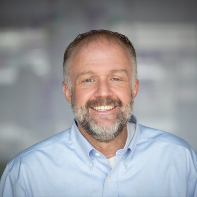
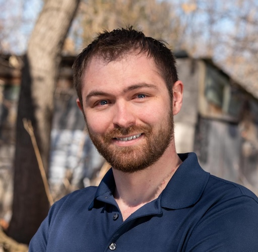
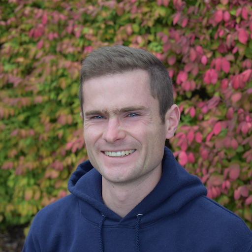
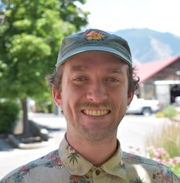
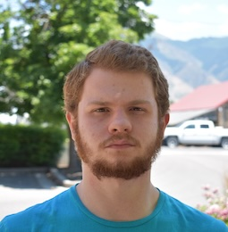
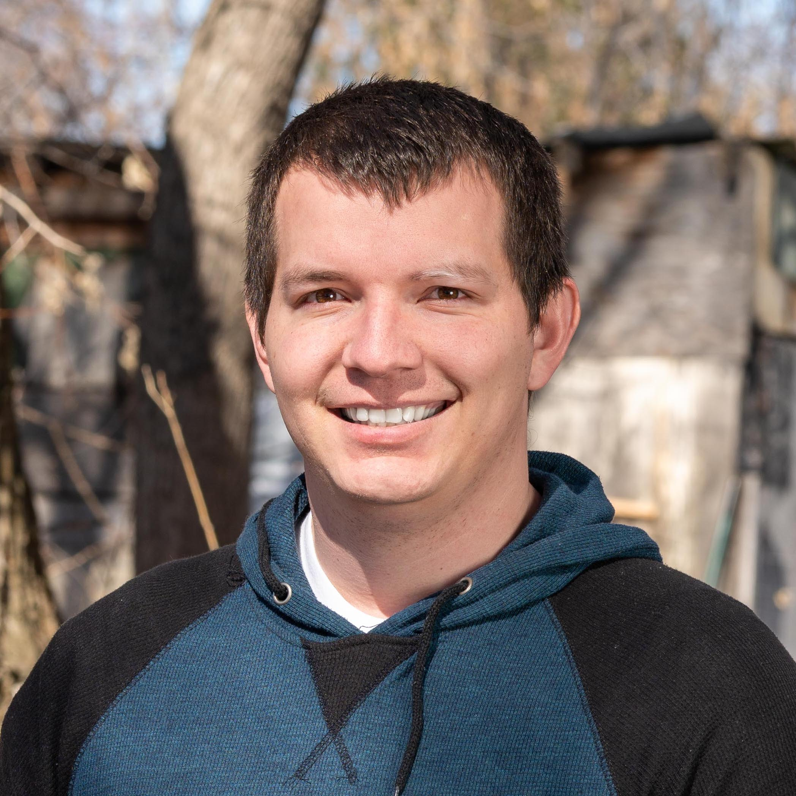
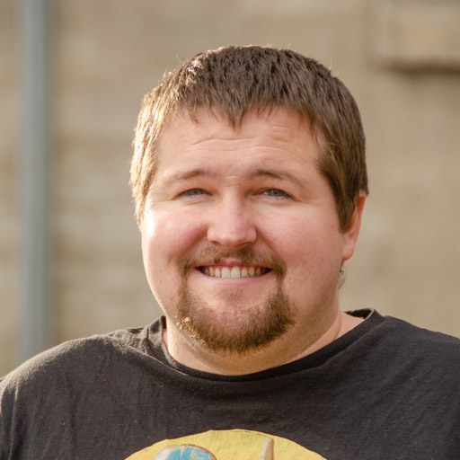
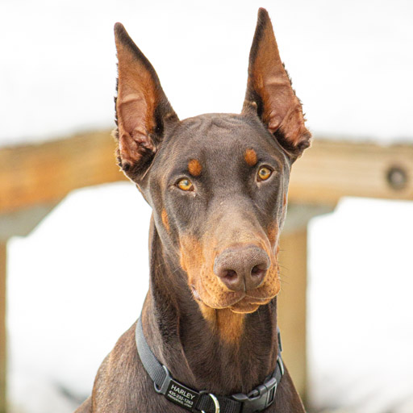

# Meet the Team

We're a tight-knit team of engineers, designers, and project managers working out of our office in Logan, Utah. No remote handoffs, no offshore outsourcing -- just talented people who love building software.

## Leadership

|||
::: card
{avatar}
### Dan
**President**

Leads the company vision and client relationships. Ensures every project gets the leadership and resources it needs to succeed.
:::
---
::: card
{avatar}
### Joseph
**General Manager**

Keeps the engine running. Operations, resourcing, and making sure the team has everything they need to do their best work.
:::
---
::: card
{avatar}
### Eric
**Business Development**

Your first point of contact. Understands your business needs and connects you with the right team to bring your vision to life.
:::
|||

## Project Management

|||
::: card
{avatar}
### Justin
**Project Manager**

Keeps projects on track with clear communication and organized sprints. Your direct line to the development team.
:::
---
::: card
{avatar}
### Alex
**Project Manager**

Manages complex builds with an emphasis on quality and timeline. Believes in the strength that comes from enduring difficult challenges.
:::
|||

## Engineering

|||
::: card
{avatar}
### Wesley
**Software Engineer**

A craftsman who believes the best code is the code you don't have to write. Efficiency and clarity in every line.
:::
---
::: card
{avatar}
### Hunter
**Software Engineer**

Full-stack problem solver. Tackles challenges across mobile, web, and backend with equal confidence.
:::
---
::: card
{avatar}
### Levi
**Software Engineer**

Reliable and thorough. Delivers clean, well-tested code that works the first time.
:::
|||

|||
::: card
{avatar}
### Albin
**Software Engineer**

Understands that nobody knows everything -- and that's what makes collaboration powerful.
:::
---
::: card
{avatar}
### Brady
**Software Engineer**

Brings energy and directness to every project. Not afraid to question assumptions and push for better solutions.
:::
---
::: card
{avatar}
### Jacey
**Software Engineer**

Believes in doing it scared if you have to. Tackles unfamiliar challenges head-on and grows from every one.
:::
|||

|||
::: card
{avatar}
### Trax
**Software Engineer**

Focused and methodical. Follows the path that works and doesn't overcomplicate things.
:::
---
::: card
{avatar}
### Merdan
**Data Analytics Engineer**

Turns raw data into actionable insights. Builds the pipelines and dashboards that help clients understand their business.
:::
|||

## Design & Security

|||
::: card
{avatar}
### Elsie
**UX/UI Designer**

Believes simplicity is the ultimate sophistication. Creates interfaces that are intuitive, beautiful, and purposeful.
:::
---
::: card
{avatar}
### Harley
**Senior Security Specialist**

Keeps our systems and our clients' systems safe. Security isn't an afterthought -- it's built into everything we deliver.
:::
|||

## Work With Us

Interested in joining the team or starting a project? We'd love to hear from you.

[Let's Talk](contact.md)
